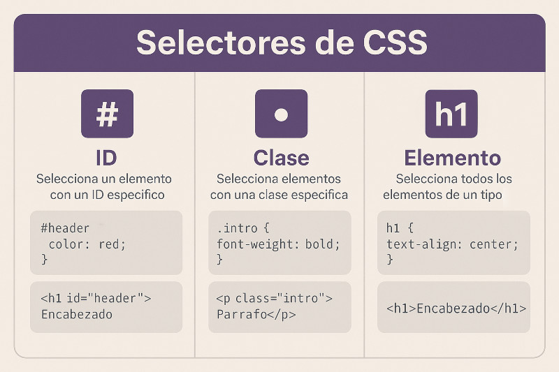

# Ejercicio 04 - CSS

## Introducción

Las **CSS** (*Cascading Style Sheets*) son el lenguaje usado para darle diseño y presentación a un documento HTML. Mientras HTML define la estructura, CSS se encarga de colores, fuentes, tamaños y disposición de los elementos.

---

## Síntesis

CSS funciona con **reglas** formadas por un selector, una propiedad y un valor. Las tres formas de aplicarlo son:

- **En línea:** con el atributo `style` directamente en la etiqueta
- **Interno:** dentro de `<style>` en el `<head>`
- **Externo:** en un archivo `.css` separado vinculado con `<link>`

---

## Reflexión

CSS me parece útil porque con pocas líneas se puede transformar completamente el aspecto de una página. Entender la cascada y la especificidad ayuda a evitar errores comunes al diseñar.

---

## Conclusión

CSS es **indispensable** en el desarrollo web. Junto con HTML y JavaScript forma la base de cualquier página, permitiendo crear interfaces atractivas y funcionales.
