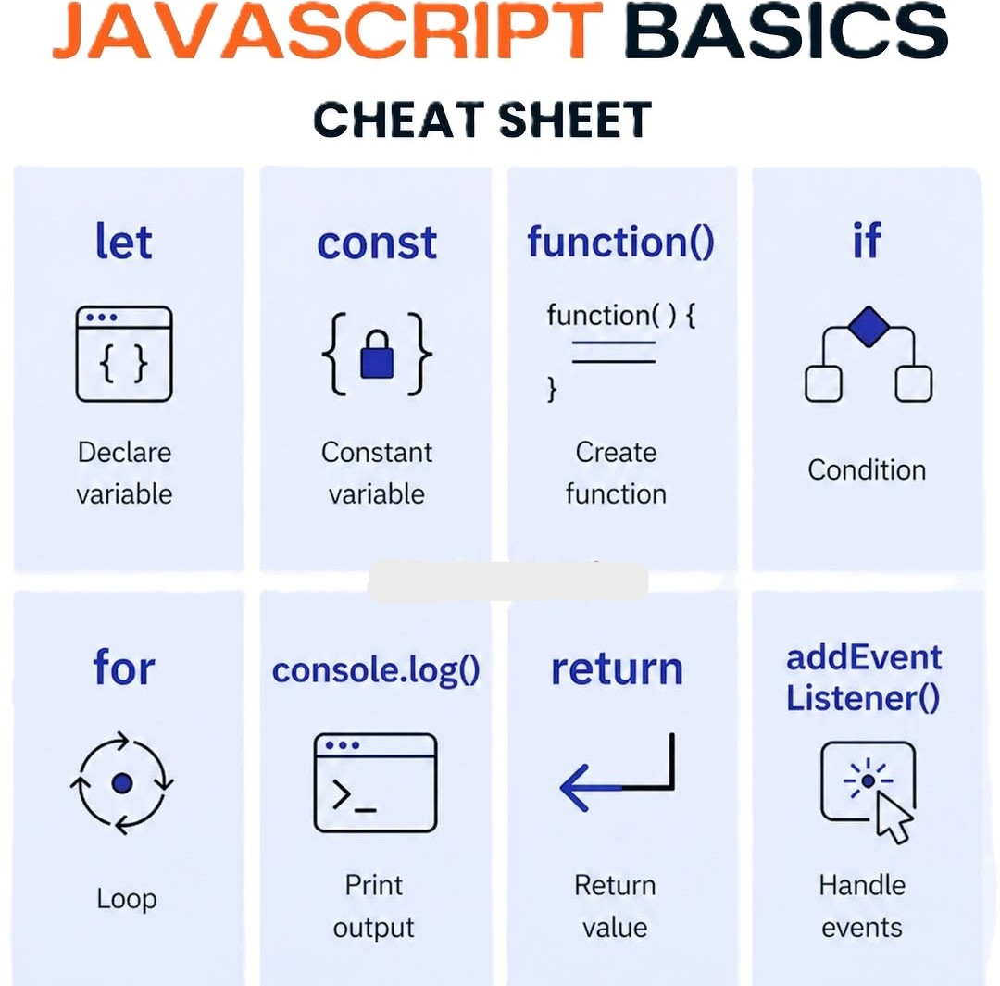

# Ejercicio 05 - JavaScript

## Introducción

**JavaScript** es el lenguaje de programación que permite agregar interactividad y dinamismo a las páginas web. Junto con HTML y CSS, forma la triada esencial del desarrollo web, siendo el único lenguaje de programación que los navegadores pueden ejecutar de forma nativa.

---

## Síntesis

JavaScript permite manipular el DOM, responder a eventos del usuario y comunicarse con servidores. Sus conceptos fundamentales son:

- **Variables:** almacenan datos usando `var`, `let` o `const`
- **Funciones:** bloques de código reutilizables definidos con `function`
- **Condicionales:** toman decisiones con `if`, `else` y `switch`
- **Bucles:** repiten código con `for`, `while` y `forEach`
- **Eventos:** reaccionan a acciones del usuario con `addEventListener`

---

## Reflexión

Lo que más me parece útil de JavaScript es que con él una página deja de ser estática y cobra vida. Poder responder a clics, validar formularios o actualizar contenido sin recargar la página son cosas que solo JS hace posible. Es un lenguaje muy versátil que se usa tanto en el frontend como en el backend.

---

## Conclusión

JavaScript es indispensable para el desarrollo web moderno. Dominar sus bases permite crear experiencias interactivas y dinámicas, y abre la puerta a frameworks populares como React, Vue y Node.js.
